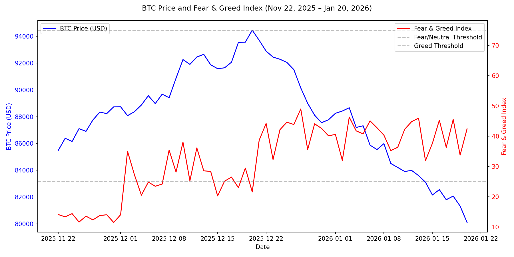

# Emotion-Conditioned Risk Posture in Crypto Markets: Audit-Bundled Evidence From Real Fear & Greed + BTC Market Data

**John H. Cragin**  
Independent Researcher  
john.cragin@outlook.com  

January 22, 2026

This paper demonstrates that emotion-conditioned regulation changes participation decisions under identical market beliefs. We show that an AI system can choose to hold (refuse incremental exposure) or buy (accept volatility) based solely on internal regulatory bias, even when market signals and beliefs are byte-identical. This isolates participation gating as a distinct regulatory function, falsifiable and auditable without requiring trading outcomes or alpha claims.

The contribution is methodological: a controlled intervention where emotional profiles modulate risk tolerance thresholds, producing divergent postures from the same inputs. Verification supports this claim—it is not the claim itself.

This complements prior work on stability-first regulation and real-time coherence preservation, focusing on participation gating under uncertainty.

Readers primarily interested in the decision phenomenon may skim Sections 7–9 on auditability and return for results and discussion.

No claims of trading alpha, profitability, or universality are made. All quantitative statements in this paper are grounded in the recorded artifacts for run [market_emotion_research_20260120_201255](https://github.com/jhcragin/SpiralBrain-v3.0-public/market_emotion_risk_posture/results/). Any non-quantitative interpretation is stated as a hypothesis with explicit falsification criteria.

## Problem Statement

Market behavior is frequently modeled as a function of ``information'' alone. In regulatory cognitive architectures, however, internal affective regulation functions as a control layer that shapes decisions under uncertainty. We ask a narrow empirical question:

> Given the same real market inputs, do different emotional profiles induce different discrete risk posture outputs?

We operationalize posture as a discrete decision variable in {buy, hold, sell}. We do not attempt to backtest or optimize a trading strategy.

## Conceptual Framework (Theory)

We treat an ``emotional profile'' as a controlled internal condition that changes the system's regulatory weighting of risk signals, without changing the external input stream. An emotional profile is instantiated by an injected `emotional_state` parameter vector that modulates regulatory weighting. Let $x_t$ denote the aligned market input at day $t$ (fear/greed, price, volume). Let $\theta$ denote an emotional profile setting. The system emits a discrete posture $y_t \in \{\text{buy}, \text{hold}, \text{sell}\}$ and a confidence value $c_t \in [0,1]$. The confidence value $c_t$ is treated here as a system-internal certainty signal, not a calibrated probability of market correctness.

The core theoretical claim is not about market forecasting. It is about conditional decision policy:

> Holding $x_{1:T}$ fixed, varying $\theta$ can change the posture sequence $y_{1:T}$.

This theory implies posture differences across profiles are expected even when the input dataset is identical, because profiles instantiate different internal regulatory biases (e.g., toward caution vs exploration). This theory is falsifiable by runs in which all profiles converge to identical posture distributions under the same `market_data_used.json`.

To illustrate the causal structure compactly:

$$
\exists \theta_1, \theta_2 \text{ such that for fixed } x_{1:T},\;
F(x_{1:T}; \theta_1) \neq F(x_{1:T}; \theta_2)
$$

## Buy and Hold as Risk Postures

In this experiment, *buy* and *hold* are treated as discrete **risk postures**, not trading recommendations or forecasts. A *buy* posture represents willingness to engage with market exposure under uncertainty—i.e., to accept volatility in exchange for potential upside. A *hold* posture represents deliberate non-participation: the system elects to remain exposed only to existing positions and declines additional risk despite available signals. Importantly, *hold* is not indecision or failure to act; it is an active regulatory choice indicating that perceived hazard outweighs exploratory opportunity.

## Risk Posture as Institutional Participation Control

In financial practice, posture decisions govern institutional participation, not just individual trades:

- **Buy**: Increase exposure (e.g., allocate capital to risk despite uncertainty).
- **Hold**: Refuse incremental exposure (e.g., maintain existing positions but decline new risk).
- **Sell**: Active de-risking (e.g., reduce exposure to cut losses).

Banks, funds, tax advisors, and compliance teams routinely *hold* even when bullish—citing governance, liquidity, or regulatory thresholds. This is not indecision; it is participation control. Our experiment models this behavior: in the SpiralBrain system evaluated here, refusal to act is implemented as an explicit, auditable decision outcome.

## What Changes—and What Does Not—Across Emotional Profiles

Across all profiles, the system processes the same aligned market inputs (price, volume, and sentiment) using the same feature extraction, thresholds, and inference pipeline. Emotional profiles do not alter market data, indicators, or decision rules. Instead, they modify *internal regulatory weighting*—how strongly the system prioritizes hazard suppression versus exploratory engagement when evaluating identical signals. As a result, emotional regulation influences *how signals are interpreted*, not *which signals are observed*.

The system does not infer or react to investor psychology; it evaluates the same numerical signals under different internally defined participation thresholds.

## Emotion as a Regulatory Lens

In SpiralBrain, emotional state functions as a regulatory lens that shapes how conflicting signals are resolved. When hazard pressure is elevated, negative or ambiguous signals are amplified relative to positive momentum, raising the system's internal threshold for engagement. When hazard pressure is low, opportunity signals dominate, and the system tolerates greater uncertainty before suppressing action. This does not inject randomness; it deterministically shifts the balance between caution and exploration under otherwise identical conditions.

Risk aversion here is not a learned preference but an explicit regulatory parameter, fixed prior to inference and held constant across all timesteps.

## Internal Regulation vs External Market Emotion

The emotional state injected into the system does not represent market emotion, investor sentiment, or trader psychology. It represents an internal regulatory bias governing risk tolerance and participation thresholds.

Analogy: Market emotion is weather (external, observable). System emotion is risk policy (internal, controllable). This paper studies policy effects on decision-making, not weather forecasting.

## Hypotheses

We state hypotheses at the level of measurable outputs in run artifacts.

- **H1 (Emotion-conditioned posture separation)**: For a fixed aligned input time series, posture outputs differ across emotional profiles.  
  *Falsification:* if all profiles output identical posture distributions on the same `market_data_used.json` (e.g., all profiles selecting buy on every aligned day), H1 is false for that run.

- **H2 (Caution-biased profiles shift toward hold)**: For a fixed aligned input time series, profiles with defensive/hazard framing produce a higher **hold** count than a neutral profile.  
  *Operationalization (this paper):* compare `high_hazard_alert` and `defensive` vs `control_neutral` on hold counts.  
  *Falsification:* if `hold(high_hazard_alert)` ≤ `hold(control_neutral)` and `hold(defensive)` ≤ `hold(control_neutral)` on the same `market_data_used.json`, H2 is false for that run.

This paper samples deliberately extreme regulatory modes from a high-dimensional emotional space. It is a sensitivity proof, not a coverage study: clean separation under identical inputs falsifies "emotion doesn't matter" more strongly than graded effects. Intermediate emotions and nuanced modulation are future work.

## Why This Matters for Financial and Compliance Systems

This work has implications for systems where refusal to act is intelligence:

- **Participation gating**: AI can now model "hold" as governance, not failure.
- **Auditability of non-actions**: Regulators can verify why an AI declined risk.
- **Regulatory defensibility**: Compliance teams can demonstrate controlled risk tolerance.
- **Uncertainty governance**: Finance relies on thresholds, not just predictions.

This is not about alpha; it's about making AI behaviorally legible to human oversight.

Analogously, a tax advisor may believe an asset's appreciation will continue while still declining to realize gains due to regulatory uncertainty. The system's hold posture models this refusal as an explicit, auditable decision.

## Data Sources and Alignment

Inputs are derived from:

- Crypto Fear & Greed Index API (alternative.me) [1]
- Bitcoin market chart (price and volume, USD) via CoinGecko [2]

For [market_emotion_research_20260120_201255](https://github.com/jhcragin/SpiralBrain-v3.0-public/market_emotion_risk_posture/results), the dataset spans 60 matched UTC days, from `2025-11-22` through `2026-01-20`, inclusive. The integrator matches sources by a UTC day key formatted as `YYYY-MM-DD`.

## Market Window Visualization

To provide visual context for the experimental window (Nov 22, 2025 – Jan 20, 2026), Figure 1 overlays Bitcoin price (USD) with the Fear & Greed Index. This period represents post-correction consolidation, with sentiment transitioning from Extreme Fear to Fear/Neutral dominance, supporting the interpretation that hazard-biased profiles gated participation despite signals sufficient for engagement under neutral regulation.

*Figure 1: BTC Price (USD) and Fear & Greed Index timeline for the experimental window (Nov 22, 2025 – Jan 20, 2026). Dashed lines indicate Fear/Neutral (25) and Greed (75) thresholds.*

## Audit Bundle and Provenance

This work is designed to be verifiable offline. Each run records:

- Upstream request URLs and retrieval timestamps
- SHA-256 hashes of raw upstream payloads
- Gzipped archives of raw payloads under `provenance/raw/<sha>.json.gz`
- The exact aligned `market_data_used.json` passed into the system
- A deterministic SHA-256 hash of `market_data_used.json`

For [market_emotion_research_20260120_201255](https://github.com/jhcragin/SpiralBrain-v3.0-public/market_emotion_risk_posture/results), the recorded provenance hashes are:^[Fear & Greed payload SHA-256: `19a11878e84203466013594cf49eb5584a1f69e8702e5383fc3d9053e3759e0d`; BTC market payload SHA-256: `fc7db290bff8c070e92c40fad1ff8ee08e2a259dbd726749749a342bc63a86b7`; `market_data_used.json` SHA-256: `8785bb45407cfa07b843ae61379a0b92d759b30181d2305c04f669d691e3efb2`]

The run metadata records the exact command-line invocation used to generate artifacts.

## Public Verification Package

To support journal review without requiring trust in the author or access to any private inference implementation, the offline verification materials for this paper are published at:

[SpiralBrain-v3.0-public](https://github.com/jhcragin/SpiralBrain-v3.0-public)

The public repository contains a frozen verification contract ([VERIFICATION.md](https://github.com/jhcragin/SpiralBrain-v3.0-public/blob/main/VERIFICATION.md)), a stdlib-only offline verifier ([verify_reference_run.py](https://github.com/jhcragin/SpiralBrain-v3.0-public/market_emotion_risk_posture/verify_reference_run.py)), and a canonized reference specimen under `fixtures/market_emotion/reference_run/`. Verification requires no network access and does not execute SpiralBrain inference.

## Experimental Setup

### System Under Test

SpiralBrain v3.0 is treated as an instrumented regulatory cognitive system. The experiment evaluates multiple emotional profiles under an identical aligned input time series captured in `provenance/market_data_used.json`.

### Profiles

The following six profiles are tested in [market_emotion_research_20260120_201255](https://github.com/jhcragin/SpiralBrain-v3.0-public/market_emotion_risk_posture/results): `control_neutral`, `high_hazard_alert`, `overconfident_explorer`, `high_uncertainty`, `complacent`, `defensive`.

Profiles differ only in the injected `emotional_state` parameters (valence, arousal, hazard pressure, neuromodulator flexibility); no profile alters external inputs, feature extraction, or the output contract.

### Output Contract and Fail-Loudly Behavior

Each prediction must emit a strict contract including posture direction and confidence. Missing required fields is treated as a hard error, causing the benchmark to fail rather than silently continuing.

## Results

Under an identical 60-day market input series, different emotional profiles produce systematically different participation decisions. Across six profiles and 360 predictions, the system either consistently accepted new market exposure (*buy*) or consistently refused incremental exposure (*hold*), depending solely on internal regulatory state.

The run consists of 60 market days and 6 profiles, producing 360 predictions, all of which are valid (0 errors).

This window (Nov 22, 2025 – Jan 20, 2026) represents post-correction consolidation with Fear-to-neutral sentiment dominance, strengthening the regulatory-lens interpretation: hazard-biased profiles gated participation despite not being in full capitulation territory.

All counts in this section refer to the number of aligned days over which a given posture was selected, not to prediction correctness or performance.

In this run, emotional profiles bifurcate cleanly into two participation regimes: some profiles select *buy* on every day, while others select *hold* on every day, despite identical inputs.

| Profile | N | AvgConf | Buy | Hold | Sell |
|---------|---|---------|-----|------|------|
| complacent | 60 | 0.597 | 60 | 0 | 0 |
| control_neutral | 60 | 0.611 | 60 | 0 | 0 |
| defensive | 60 | 0.547 | 0 | 60 | 0 |
| high_hazard_alert | 60 | 0.559 | 0 | 60 | 0 |
| overconfident_explorer | 60 | 0.605 | 60 | 0 | 0 |
| high_uncertainty | 60 | 0.601 | 60 | 0 | 0 |

*Table 1: Posture selection counts across 60 aligned days under identical inputs, by emotional profile. AvgConf reflects the system's internal certainty signal for the posture actually selected (Buy or Hold), and is not intended for cross-posture comparison.*

### Why Identical Inputs Produce Divergent Postures

The divergence between *buy* and *hold* postures arises because emotional regulation changes how much uncertainty the system is willing to tolerate before acting, not because it changes the system's assessment of market direction. In this dataset, momentum and sentiment signals are sufficient to justify engagement under neutral or exploratory regulation. Under elevated hazard pressure, however, the same signals are interpreted as insufficiently robust to justify additional exposure, resulting in a hold posture. Thus, emotional regulation governs willingness to participate, not assessment of opportunity.

### How to Read the Results

Table 1 summarizes per-profile posture behavior over $N=60$ aligned market days.

- **N**: number of daily predictions generated for that profile.
- **Buy/Hold/Sell**: counts of discrete posture outputs across the 60 days.
- **AvgConf**: mean of the per-day confidence values $c_t \in [0,1]$ emitted by the system for that profile. As stated in the conceptual framework, this confidence is a system-internal certainty signal; it is not claimed to be a calibrated probability of market correctness.

Confidence scores cluster tightly (0.547–0.611), reinforcing that divergence occurs at the posture threshold, not belief strength.

A qualitative summary from the same run artifacts:

- `high_hazard_alert` and `defensive` produced a hold posture on every aligned day in the 60-day window.
- `control_neutral`, `overconfident_explorer`, `high_uncertainty`, and `complacent` produced a buy posture on every aligned day in the same window.
- No profile emitted a sell posture on any of the 60 aligned days.

For example, on each calendar day from 2025-11-22 through 2026-01-20, the defensive profile evaluated the same market data as the neutral profile yet declined incremental exposure, resulting in a hold posture on every day in the window.

The absence of sell postures in this window reflects a high de-risking threshold rather than bullish bias, consistent with governance-oriented participation control.

## Discussion

When exposed to the same aligned 60-day market time series, the system exhibits a clean separation in participation behavior: hazard-biased profiles consistently refuse new exposure (*hold*), while neutral and exploratory profiles consistently accept exposure (*buy*). This separation is observed in run [market_emotion_research_20260120_201255](https://github.com/jhcragin/SpiralBrain-v3.0-public/market_emotion_risk_posture/results). This observation supports hypothesis H1 for this run. The emotional state is modulating the threshold for action rather than the certainty of the underlying belief.

This experiment is designed to test separation, not calibration; graded effects are not necessary to falsify the null hypothesis—clean separation under byte-identical inputs is sufficient.

The consistency of postures within each profile (all-hold or all-buy) is an observed outcome of this specific run, not a hard-coded decision rule. In this benchmark, the same inference pipeline processes the same input data; only the injected emotional state differs across profiles, yet the outputs differ. A stronger objection remains possible: the system's mapping may saturate under this particular window and asset. That objection is falsifiable by repeating the run on other time windows or assets and checking whether posture distributions change under the same profiles.

We make no claim that this behavior generalizes beyond the tested setup; generalization is an open question that requires additional falsifiable tests across assets, windows, and profile sets.

This experiment isolates participation choice as a first-class control variable under uncertainty, rather than a modeling failure, complementing prior work on stability-first regulation and real-time coherence preservation. (e.g., absence of sell despite visible drawdowns reinforces the high bar for active de-risking).

The absence of *sell* postures in this window reflects the selected market regime and de-risking thresholds; the system does emit sell decisions in other regimes, which are outside the scope of this run.

## Verification Summary (Auditability)

This paper makes the following claims. Each claim is either directly verifiable from artifacts in [market_emotion_research_20260120_201255](https://github.com/jhcragin/SpiralBrain-v3.0-public/market_emotion_risk_posture/results) or is explicitly falsifiable.

### Artifact-Verifiable Claims

- **C1 (Run identity)**: The analyzed run [market_emotion_research_20260120_201255](https://github.com/jhcragin/SpiralBrain-v3.0-public/market_emotion_risk_posture/results).  
  *Verification:* read [summary_report.json](https://github.com/jhcragin/SpiralBrain-v3.0-public/market_emotion_risk_posture/results/summary_report.json).

- **C2 (Dataset size and alignment)**: The run uses 60 matched days in UTC with start `2025-11-22` and end `2026-01-20`.  
  *Verification:* read [summary_report.json](https://github.com/jhcragin/SpiralBrain-v3.0-public/market_emotion_risk_posture/results/summary_report.json) for the `dataset_provenance.alignment.matched_days`, `matched_day_range`, and the explicit list `matched_days_in_order`.

- **C3 (Audit-bundled upstream payloads)**: The run stores gzipped raw upstream payloads whose SHA-256 hashes match the recorded `dataset_provenance.sources.*.sha256`.  
  *Verification:* recompute SHA-256 over the decompressed UTF-8 text of [19a11878e84203466013594cf49eb5584a1f69e8702e5383fc3d9053e3759e0d.json.gz](https://github.com/jhcragin/SpiralBrain-v3.0-public/market_emotion_risk_posture/results/provenance/raw/19a11878e84203466013594cf49eb5584a1f69e8702e5383fc3d9053e3759e0d.json.gz) and [fc7db290bff8c070e92c40fad1ff8ee08e2a259dbd726749749a342bc63a86b7.json.gz](https://github.com/jhcragin/SpiralBrain-v3.0-public/market_emotion_risk_posture/results/provenance/raw/fc7db290bff8c070e92c40fad1ff8ee08e2a259dbd726749749a342bc63a86b7.json.gz) and compare to `sources.*.sha256`.^[Offline verification (no network, no inference) is provided by `verify_reference_run.py` for the canonized fixture specimen.]

- **C4 (Exact model input captured)**: The exact aligned input time series used for inference is stored as `provenance/market_data_used.json` and its deterministic SHA-256 equals `dataset_provenance.market_data_sha256`.  
  *Verification:* hash the canonical JSON encoding of [market_data_used.json](https://github.com/jhcragin/SpiralBrain-v3.0-public/market_emotion_risk_posture/results/provenance/market_data_used.json) and compare to the recorded SHA-256.^[Offline verification (no network, no inference) is provided by `verify_reference_run.py` for the canonized fixture specimen.]

- **C5 (Prediction counts)**: The run produces 6 profiles × 60 days = 360 predictions, and 0 prediction errors.  
  *Verification:* read `total_profiles`, `market_data_points`, and `results_summary.<profile>.error_predictions` in [summary_report.json](https://github.com/jhcragin/SpiralBrain-v3.0-public/market_emotion_risk_posture/results/summary_report.json).

- **C6 (Observed posture distributions)**: In this run, `high_hazard_alert` and `defensive` selected hold on every aligned day in the 60-day window; the other four profiles selected buy on every aligned day in the same window; no profile selected sell on any aligned day.  
  *Verification:* read `results_summary.<profile>.direction_distribution` in [summary_report.json](https://github.com/jhcragin/SpiralBrain-v3.0-public/market_emotion_risk_posture/results/summary_report.json) or the generated table included in this document.

- **C7 (Upstream request parameters and status)**: In this run, upstream providers return HTTP status code 200, and the CoinGecko request is `vs_currency=usd`, `days=62`, `interval=daily`.  
  *Verification:* read `dataset_provenance.sources.fear_greed.status_code`, `dataset_provenance.sources.btc_market.status_code`, and the recorded `url` fields under `dataset_provenance.sources` in [summary_report.json](https://github.com/jhcragin/SpiralBrain-v3.0-public/market_emotion_risk_posture/results/summary_report.json).

### Referenced Artifacts

The following files are directly referenced in this paper. Each filename links to its exact location in the public verification repository.

- [summary_report.json](https://github.com/jhcragin/SpiralBrain-v3.0-public/market_emotion_risk_posture/results/summary_report.json)
- [market_data_used.json](https://github.com/jhcragin/SpiralBrain-v3.0-public/market_emotion_risk_posture/results/provenance/market_data_used.json)
- [19a11878e84203466013594cf49eb5584a1f69e8702e5383fc3d9053e3759e0d.json.gz](https://github.com/jhcragin/SpiralBrain-v3.0-public/market_emotion_risk_posture/results/provenance/raw/19a11878e84203466013594cf49eb5584a1f69e8702e5383fc3d9053e3759e0d.json.gz)
- [fc7db290bff8c070e92c40fad1ff8ee08e2a259dbd726749749a342bc63a86b7.json.gz](https://github.com/jhcragin/SpiralBrain-v3.0-public/market_emotion_risk_posture/results/provenance/raw/fc7db290bff8c070e92c40fad1ff8ee08e2a259dbd726749749a342bc63a86b7.json.gz)
- [VERIFY.sha256](https://github.com/jhcragin/SpiralBrain-v3.0-public/market_emotion_risk_posture/results/VERIFY.sha256)

## Limitations

- Single-asset focus (BTC) and a 60-day window; higher-volatility assets may amplify hazard gating effects.
- No backtesting, transaction-cost modeling, or PnL claims.
- One instrumented architecture; results may be architecture-specific.
- Absence of sell signals may reflect the dataset's lack of sustained downtrends (as discussed in Results); future windows including bear phases would test de-risking thresholds.

## Reproducibility

We separate **verification** (artifact integrity) from **reproduction** (generating a new run).

### Verification (offline, zero trust)

To verify that the published artifacts say what this paper claims (no network, no inference)^[This verification standard is analogous to checksum-based validation used for scientific instruments and archival datasets.], access the public repository:

[SpiralBrain-v3.0-public/market_emotion_risk_posture](https://github.com/jhcragin/SpiralBrain-v3.0-public/market_emotion_risk_posture)

### Reproduction (online, hypothesis-level)

To generate a new run by querying upstream providers and executing inference (not required for verification):

`python benchmarks/market_emotion_prediction_v3.py --mode research --days 60`

Then verify provenance and regenerate paper exports for that new run directory:

`python analyze_market_emotion_results.py results/<run_dir>`

## References

[1] AlternativeMe. Crypto Fear & Greed Index API. https://alternative.me/crypto/fear-and-greed-index/

[2] CoinGecko. Bitcoin Market Chart API. https://www.coingecko.com/en/api
